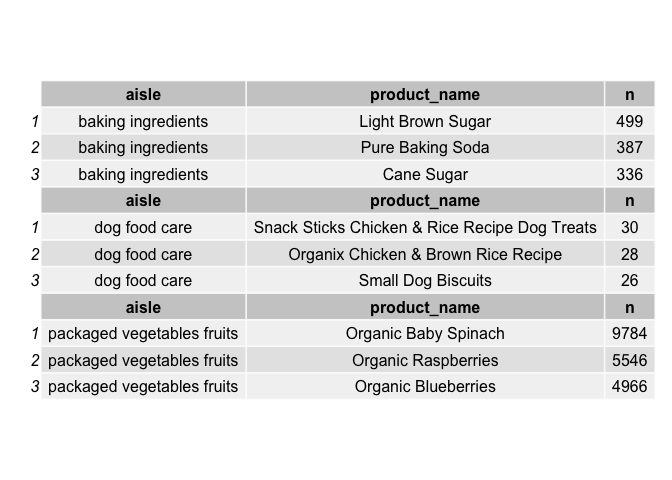
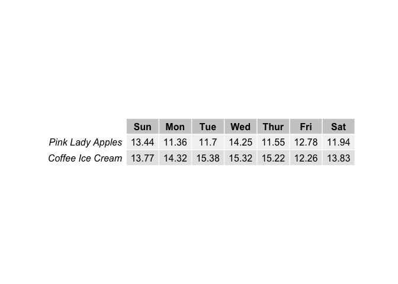
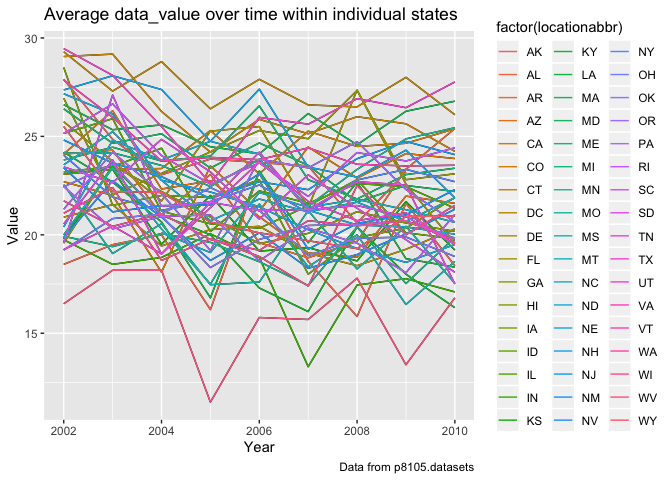
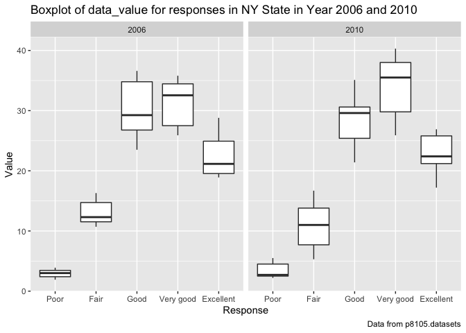
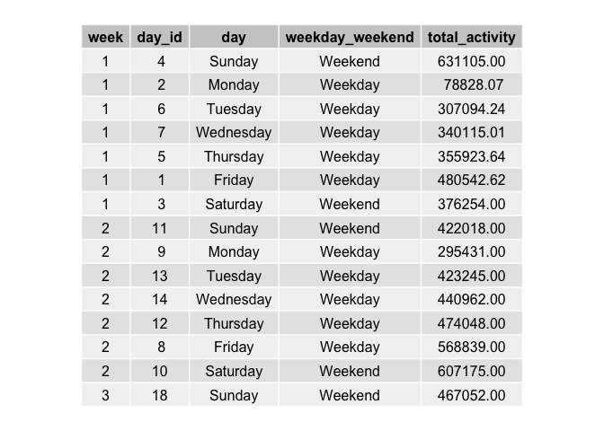
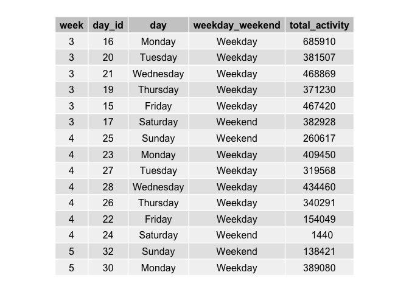
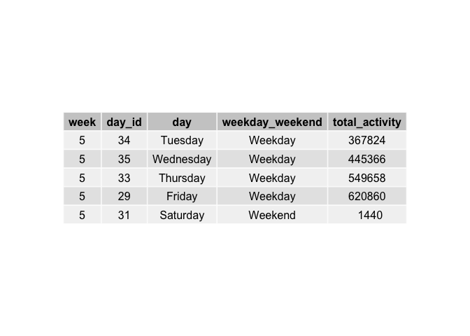
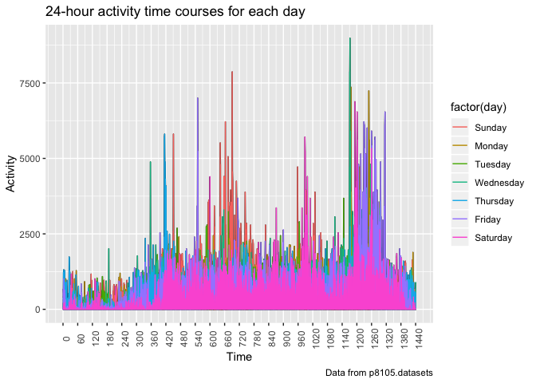

p8105\_hw3\_sl4659
================
Shenglin Liu
10/9/2019

## Problem 1

The dataset contains 1,384,617 observations of 131,209 unique users,
where each row in the dataset is a product from an order. There is a
single order per user in this dataset. There are 15 variables in the
dataset. The variable reordered is 1 if this prodcut has been ordered by
this user in the past, 0 otherwise. The variable order\_dow identifies
the day of the week on which the order was placed. The variable
order\_hour\_of\_day identifies the hour of the day on which the order
was placed. In addition, product\_name, aisle, and department are all
key variables. Let’s take the third observation as an example. It shows
that user with id 112108 ordered organic celery hearts in the fresh
vegetables aisle under the produce department. The order was at 10 on
Thursday and it has been 9 days since the user’s last order. It is also
the first time this user ordered this
    product.

``` r
library(tidyverse)
```

    ## ── Attaching packages ─────────────────────────────────────────────────────────── tidyverse 1.2.1 ──

    ## ✔ ggplot2 3.2.1     ✔ purrr   0.3.2
    ## ✔ tibble  2.1.3     ✔ dplyr   0.8.3
    ## ✔ tidyr   1.0.0     ✔ stringr 1.4.0
    ## ✔ readr   1.3.1     ✔ forcats 0.4.0

    ## ── Conflicts ────────────────────────────────────────────────────────────── tidyverse_conflicts() ──
    ## ✖ dplyr::filter() masks stats::filter()
    ## ✖ dplyr::lag()    masks stats::lag()

``` r
library(grid)
library(gridExtra)
```

    ## 
    ## Attaching package: 'gridExtra'

    ## The following object is masked from 'package:dplyr':
    ## 
    ##     combine

``` r
library(data.table)
```

    ## 
    ## Attaching package: 'data.table'

    ## The following objects are masked from 'package:dplyr':
    ## 
    ##     between, first, last

    ## The following object is masked from 'package:purrr':
    ## 
    ##     transpose

``` r
library(p8105.datasets)

# load instacart dataset
data(instacart)
# create a tibble for matching pairs of aisle_id and aisle
aisle_pair = distinct(instacart, aisle_id, aisle)
aisle_pair = arrange(aisle_pair, aisle_id)
# create a tibble for aisle_id frequency counts
aisle_fre = count(instacart, aisle_id)
# join dataframes aisle_fre and aisle_pair
aisle_df = left_join(aisle_pair, aisle_fre)
```

    ## Joining, by = "aisle_id"

``` r
aisle_df = arrange(aisle_df, desc(n))
```

There are 134 aisles. Top 5 aisles that the most items are ordered from:
fresh vegetables, fresh fruits, packaged vegetables fruits, yogurt,
packaged cheese.

``` r
aisle_10000 = filter(aisle_df, n > 10000)
# Basic barplot
ggplot(data = aisle_10000, aes(x = reorder(aisle, n), y = n, fill = "red")) +
  geom_bar(stat = "identity") + 
# horizontal barplot
  coord_flip() +
  guides(fill = FALSE) +
# title, label and caption
  labs(
    title = "Aisles with more than 10000 items ordered",
    x = "Aisle",
    y = "Number of items ordered",
    caption = "Data from p8105.datasets"
  )
```

<!-- -->

``` r
# create a tibble for baking ingredients frequency counts and select top 3
bi_df = filter(instacart, aisle == "baking ingredients")
bi_fre = count(bi_df, product_name)
bi_fre$aisle = "baking ingredients"
bi_fre = arrange(bi_fre, desc(n))
bi_top3 = bi_fre[1:3, ]
# create a tibble for dog food care frequency counts and select top 3
dfc_df = filter(instacart, aisle == "dog food care")
dfc_fre = count(dfc_df, product_name)
dfc_fre$aisle = "dog food care"
dfc_fre = arrange(dfc_fre, desc(n))
dfc_top3 = dfc_fre[1:3, ]
# create a tibble for packaged vegetables fruits frequency counts and select top 3
pvf_df = filter(instacart,aisle == "packaged vegetables fruits")
pvf_fre = count(pvf_df, product_name)
pvf_fre$aisle = "packaged vegetables fruits"
pvf_fre = arrange(pvf_fre, desc(n))
pvf_top3 = pvf_fre[1:3, ]
# merge vertically and reorder columns
top3_df = rbind(bi_top3, dfc_top3, pvf_top3)
top3_df = top3_df[c(3,1,2)]
# create subsets for three aisles
d1 = top3_df[1:3, ]
d2 = top3_df[4:6, ]
d3 = top3_df[7:9, ]
# create three separate gridtables for each aisle
g1 = tableGrob(d1)
g2 = tableGrob(d2)
g3 = tableGrob(d3)
# combine gridtables
g = gtable_combine(g1, g2, g3, along = 2)
grid.draw(g)
```

<!-- -->

``` r
# create two separate dataframes for pink lady apples and coffee ice cream
pla_df = filter(instacart, product_name == "Pink Lady Apples") 
cic_df = filter(instacart, product_name == "Coffee Ice Cream")
# compute means on each day of the week
tb1_df = tibble(
  vec_pla = c(round(mean(filter(pla_df, order_dow == 0)$order_hour_of_day), 2), round(mean(filter(pla_df, order_dow == 1)$order_hour_of_day), 2), round(mean(filter(pla_df, order_dow == 2)$order_hour_of_day), 2), round(mean(filter(pla_df, order_dow == 3)$order_hour_of_day), 2), round(mean(filter(pla_df, order_dow == 4)$order_hour_of_day), 2), round(mean(filter(pla_df, order_dow == 5)$order_hour_of_day), 2), round(mean(filter(pla_df, order_dow == 6)$order_hour_of_day), 2)),
  vec_cic = c(round(mean(filter(cic_df, order_dow == 0)$order_hour_of_day), 2), round(mean(filter(cic_df, order_dow == 1)$order_hour_of_day), 2), round(mean(filter(cic_df, order_dow == 2)$order_hour_of_day), 2), round(mean(filter(cic_df, order_dow == 3)$order_hour_of_day), 2), round(mean(filter(cic_df, order_dow == 4)$order_hour_of_day), 2), round(mean(filter(cic_df, order_dow == 5)$order_hour_of_day), 2), round(mean(filter(cic_df, order_dow == 6)$order_hour_of_day), 2))
) 
colnames(tb1_df) <- c("Pink Lady Apples", "Coffee Ice Cream")
rownames(tb1_df) <- c("Sun", "Mon", "Tue", "Wed", "Thur", "Fri", "Sat")
```

    ## Warning: Setting row names on a tibble is deprecated.

``` r
grid.table(t(tb1_df))
```

<!-- -->

## Problem 2

``` r
data(brfss_smart2010)
# format the data to use appropriate variable names
brfss = janitor::clean_names(brfss_smart2010)
# focus on the “Overall Health” topic
brfss = filter(brfss, topic == "Overall Health")
# include only responses from “Excellent” to “Poor”
brfss = filter(brfss, response == "Excellent" | response == "Very good" | response == "Good" | response == "Fair" | response == "Poor")
# organize responses as a factor taking levels ordered from “Poor” to “Excellent”
brfss$response = as.factor(brfss$response)
brfss$response = factor(brfss$response, levels = c("Poor", "Fair", "Good", "Very good", "Excellent"))
```

``` r
# create a dataframe for year 2002
brfss_2002 = filter(brfss, year == 2002)
# find distinct pairs of locationabbr and locationdesc
state_2002 = distinct(brfss_2002, locationabbr, locationdesc)
# create a tibble for location frequency counts
state_2002 = count(state_2002, locationabbr)
state_2002 = filter(state_2002, n >= 7)
# create a dataframe for year 2010
brfss_2010 = filter(brfss, year == 2010)
# find distinct pairs of locationabbr and locationdesc
state_2010 = distinct(brfss_2010, locationabbr, locationdesc)
# create a tibble for location frequency counts
state_2010 = count(state_2010, locationabbr)
state_2010 = filter(state_2010, n >= 7)
```

These states were observed at 7 or more locations in 2002: CT, FL, MA,
NC, NJ, PA. These states were observed at 7 or more locations in 2010:
CA, CO, FL, MA, MD, NC, NE, NJ, NY, OH, PA, SC, TX, WA.

``` r
# construct a dataset that is limited to Excellent responses
brfss_spa = filter(brfss, response == "Excellent")
# contain year and state
brfss_spa = select(brfss_spa, year, locationabbr, data_value)
brfss_spa = drop_na(brfss_spa, data_value)
keys = colnames(brfss_spa)[!grepl('data_value', colnames(brfss_spa))]
X = as.data.table(brfss_spa)
brfss_spa = X[,list(mean_value = mean(data_value)),keys]
# multiple groups with one aesthetic
ggplot(data = brfss_spa, aes(x = year, y = mean_value)) + 
# the group aesthetic maps a different line for each subject
  geom_line(aes(group = locationabbr)) +
  geom_line(aes(colour = factor(locationabbr)))  +
# title, label and caption
  labs(
    title = "Average data_value over time within individual states",
    x = "Year",
    y = "Value",
    caption = "Data from p8105.datasets"
  )
```

<!-- -->

``` r
# construct a dataset that is limited to locations in NY State
brfss_tp = filter(brfss, locationabbr == "NY")
# constrct a dataset that is limited to year 2006 and 2010
brfss_tp = filter(brfss_tp, year == 2006 | year == 2010)
ggplot(data = brfss_tp, aes(x = response, y = data_value)) +
  geom_boxplot() +
# facet into columns based on year
  facet_grid(. ~ year) +
# title, label and caption
  labs(
    title = "Boxplot of data_value for responses in NY State in Year 2006 and 2010",
    x = "Response",
    y = "Value",
    caption = "Data from p8105.datasets"
  )
```

<!-- -->

## Problem 3

``` r
# read data from accel_data.csv
accel_df = 
  read_csv("./accel_data.csv") %>%
  janitor::clean_names() %>% 
  # include a weekday vs weekend variable
  mutate(weekday_weekend = case_when(day == "Monday" ~ "Weekday",
                                     day == "Tuesday" ~ "Weekday",
                                     day == "Wednesday" ~ "Weekday",
                                     day == "Thursday" ~ "Weekday",
                                     day == "Friday" ~ "Weekday",
                                     day == "Saturday" ~ "Weekend",
                                     day == "Sunday" ~ "Weekend"))
```

    ## Parsed with column specification:
    ## cols(
    ##   .default = col_double(),
    ##   day = col_character()
    ## )

    ## See spec(...) for full column specifications.

``` r
# encode day with factor
accel_df$day = as.factor(accel_df$day)
accel_df$day = factor(accel_df$day, levels = c("Sunday", "Monday", "Tuesday", "Wednesday", "Thursday", "Friday", "Saturday"))
# order by week and day
accel_df = arrange(accel_df, week, day)
```

There are 35 observations of 1444 variables. The 1444 variables include:
year, day\_id, day (identifies day of week), weekday\_weekend (weekday
vs weekend) and 1440 variables for activity counts of each minute in a
24-hour day starting at midnight.

``` r
# important to create the column before the for loop
accel_df$total_activity = NA
for (rowIdx in 1:nrow(accel_df)) {
   accel_df[rowIdx, "total_activity"] = sum(accel_df[rowIdx, 4:1443])
}
# select variables to include in the table
accel_tb = select(accel_df, week, day_id, day, weekday_weekend, total_activity)
grid.table(accel_tb[1:15, ], rows = NULL)
```

<!-- -->

``` r
grid.newpage()
grid.table(accel_tb[16:30, ], rows = NULL)
```

<!-- -->

``` r
grid.newpage()
grid.table(accel_tb[31:nrow(accel_tb), ], rows = NULL)
```

<!-- -->

``` r
accel_p3 = 
  pivot_longer(
    accel_df, 
    activity_1:activity_1440,
    names_to = "time",
    names_prefix = "activity_",
    values_to = "activity")
accel_p3$time = as.numeric(accel_p3$time)
# multiple groups with one aesthetic
ggplot(data = accel_p3, aes(x = time, y = activity)) + 
# the group aesthetic maps a different line for each subject
  geom_line(aes(group = day_id)) +
  geom_line(aes(colour = factor(day)))  +
# title, label and caption
  labs(
    title = "24-hour activity time courses for each day",
    x = "Time",
    y = "Activity",
    caption = "Data from p8105.datasets"
  ) +
# adjust x-axis scale
  scale_x_continuous(breaks = seq(0, 1440, 60)) +
  theme(axis.text.x = element_text(angle = 90))
```

<!-- -->

Based on this graph, we can conclude that the subject generally has less
physical activity on Saturdays. From this graph, we can also identify
three peak hours for the subject’s physical activity, which are 11:00 ~
12:00, 16:00 ~ 17:00 and 20:00 ~ 22:00. The most intensive physical
activity occurs on a Tuesday with value greater than 8750.
