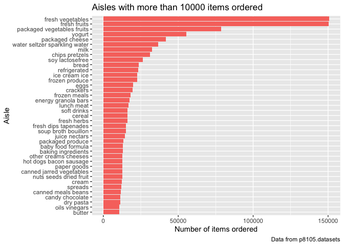

p8105\_hw3\_sl4659
================
Shenglin Liu
10/9/2019

## Problem 1

The dataset contains 1,384,617 observations of 131,209 unique users,
where each row in the dataset is a product from an order. There is a
single order per user in this dataset. There are 15 variables in the
dataset. The variable reordered is 1 if this prodcut has been ordered by
this user in the past, 0 otherwise. The variable order\_dow identifies
the day of the week on which the order was placed. The variable
order\_hour\_of\_day identifies the hour of the day on which the order
was placed. In addition, product\_name, aisle, and department are all
key variables. Let’s take the third observation as an example. It shows
that user with id 112108 ordered organic celery hearts in the fresh
vegetables aisle under the produce department. The order was at 10 on
Thursday and it has been 9 days since the user’s last order. It is also
the first time this user ordered this
    product.

``` r
library(tidyverse)
```

    ## ── Attaching packages ─────────────────────────────────────────────────────────── tidyverse 1.2.1 ──

    ## ✔ ggplot2 3.2.1     ✔ purrr   0.3.2
    ## ✔ tibble  2.1.3     ✔ dplyr   0.8.3
    ## ✔ tidyr   1.0.0     ✔ stringr 1.4.0
    ## ✔ readr   1.3.1     ✔ forcats 0.4.0

    ## ── Conflicts ────────────────────────────────────────────────────────────── tidyverse_conflicts() ──
    ## ✖ dplyr::filter() masks stats::filter()
    ## ✖ dplyr::lag()    masks stats::lag()

``` r
library(grid)
library(gridExtra)
```

    ## 
    ## Attaching package: 'gridExtra'

    ## The following object is masked from 'package:dplyr':
    ## 
    ##     combine

``` r
library(arsenal)
library(p8105.datasets)

# load instacart dataset
data(instacart)
# create a tibble for matching pairs of aisle_id and aisle
aisle_pair = distinct(instacart, aisle_id, aisle)
aisle_pair = arrange(aisle_pair, aisle_id)
# create a tibble for aisle_id frequency counts
aisle_fre = count(instacart, aisle_id)
# join dataframes aisle_fre and aisle_pair
aisle_df = left_join(aisle_pair, aisle_fre)
```

    ## Joining, by = "aisle_id"

``` r
aisle_df = arrange(aisle_df, desc(n))
```

There are 134 aisles. Top 5 aisles that the most items are ordered from:
fresh vegetables, fresh fruits, packaged vegetables fruits, yogurt,
packaged cheese.

``` r
aisle_10000 = filter(aisle_df, n > 10000)
# Basic barplot
ggplot(data = aisle_10000, aes(x = reorder(aisle, n), y = n, fill = "red")) +
  geom_bar(stat = "identity") + 
# Horizontal barplot
  coord_flip() +
  guides(fill = FALSE) +
# Title, label and caption
  labs(
    title = "Aisles with more than 10000 items ordered",
    x = "Aisle",
    y = "Number of items ordered",
    caption = "Data from p8105.datasets"
  )
```

<!-- -->

``` r
# create a tibble for baking ingredients frequency counts and select top 3
bi_df = filter(instacart, aisle == "baking ingredients")
bi_fre = count(bi_df, product_name)
bi_fre$aisle = "baking ingredients"
bi_fre = arrange(bi_fre, desc(n))
bi_top3 = bi_fre[1:3,]
# create a tibble for dog food care frequency counts and select top 3
dfc_df = filter(instacart, aisle == "dog food care")
dfc_fre = count(dfc_df, product_name)
dfc_fre$aisle = "dog food care"
dfc_fre = arrange(dfc_fre, desc(n))
dfc_top3 = dfc_fre[1:3,]
# create a tibble for packaged vegetables fruits frequency counts and select top 3
pvf_df = filter(instacart,aisle == "packaged vegetables fruits")
pvf_fre = count(pvf_df, product_name)
pvf_fre$aisle = "packaged vegetables fruits"
pvf_fre = arrange(pvf_fre, desc(n))
pvf_top3 = pvf_fre[1:3,]
# merge vertically and reorder columns
top3_df = rbind(bi_top3, dfc_top3, pvf_top3)
top3_df = top3_df[c(3,1,2)]
# create subsets for three aisles
d1 = top3_df[1:3,]
d2 = top3_df[4:6,]
d3 = top3_df[7:9,]
# create three separate gridtables for each aisle
g1 = tableGrob(d1)
g2 = tableGrob(d2)
g3 = tableGrob(d3)
# combine gridtables
g = gtable_combine(g1, g2, g3, along = 2)
grid.draw(g)
```

<!-- -->

``` r
# create two separate dataframes for pink lady apples and coffee ice cream
pla_df = filter(instacart, product_name == "Pink Lady Apples") 
cic_df = filter(instacart, product_name == "Coffee Ice Cream")
# compute means on each day of the week
tb1_df = tibble(
  vec_pla = c(round(mean(filter(pla_df, order_dow == 0)$order_hour_of_day), 2), round(mean(filter(pla_df, order_dow == 1)$order_hour_of_day), 2), round(mean(filter(pla_df, order_dow == 2)$order_hour_of_day), 2), round(mean(filter(pla_df, order_dow == 3)$order_hour_of_day), 2), round(mean(filter(pla_df, order_dow == 4)$order_hour_of_day), 2), round(mean(filter(pla_df, order_dow == 5)$order_hour_of_day), 2), round(mean(filter(pla_df, order_dow == 6)$order_hour_of_day), 2)),
  vec_cic = c(round(mean(filter(cic_df, order_dow == 0)$order_hour_of_day), 2), round(mean(filter(cic_df, order_dow == 1)$order_hour_of_day), 2), round(mean(filter(cic_df, order_dow == 2)$order_hour_of_day), 2), round(mean(filter(cic_df, order_dow == 3)$order_hour_of_day), 2), round(mean(filter(cic_df, order_dow == 4)$order_hour_of_day), 2), round(mean(filter(cic_df, order_dow == 5)$order_hour_of_day), 2), round(mean(filter(cic_df, order_dow == 6)$order_hour_of_day), 2))
) 
colnames(tb1_df) <- c("Pink Lady Apples", "Coffee Ice Cream")
rownames(tb1_df) <- c("Sun", "Mon", "Tue", "Wed", "Thur", "Fri", "Sat")
```

    ## Warning: Setting row names on a tibble is deprecated.

``` r
grid.table(t(tb1_df))
```

<!-- -->
